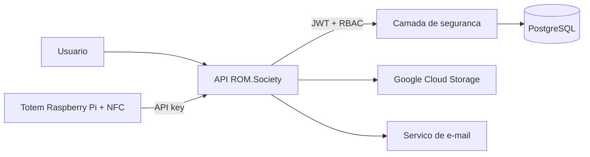

# ROM.Society

API backend para gestao de eventos e controle de acesso com totens IoT, autenticacao segura e processamento concorrente de entradas.

> Projeto de portfolio em desenvolvimento, voltado a demonstrar arquitetura backend, seguranca, integracao maquina a maquina e operacao com dispositivos Raspberry Pi/NFC.

## Visao geral

O ROM.Society conecta uma plataforma de eventos a totens de controle de acesso. A API administra usuarios, papeis e eventos, recebe solicitacoes autenticadas dos dispositivos e protege operacoes concorrentes para preservar a consistencia dos dados.

## Principais recursos

- API REST com Java 21 e Spring Boot 4
- Autenticacao JWT e autorizacao baseada em papeis (RBAC)
- Protecao de metodos com Spring Security e `@PreAuthorize`
- Comunicacao M2M com totens autenticados por chave de API
- Integracao com Raspberry Pi e leitores NFC/PN532
- Persistencia em PostgreSQL com JPA/Hibernate
- Migracoes versionadas com Flyway
- Armazenamento de arquivos no Google Cloud Storage
- Envio assincrono de e-mails
- Controle de concorrencia com optimistic locking
- Deduplicacao temporaria de requisicoes com Caffeine

## Stack

| Categoria | Tecnologias |
| --- | --- |
| Linguagem e framework | Java 21, Spring Boot 4 |
| Seguranca | Spring Security, JWT, RBAC, API keys |
| Dados | PostgreSQL, Spring Data JPA, Hibernate, Flyway |
| Integracoes | Spring Cloud OpenFeign, Google Cloud Storage, Resend |
| Mapeamento e cache | MapStruct, Caffeine |
| Infraestrutura | Docker, Docker Compose |
| Hardware | Raspberry Pi, NFC/PN532 |

## Arquitetura

O codigo e organizado por responsabilidade de dominio:

```text
src/main/java/concept/com/example/club
|- common/       # componentes compartilhados e infraestrutura transversal
|- core/         # dominios, regras de negocio e casos de uso
`- integration/  # comunicacao com servicos e dispositivos externos
```



## Executando localmente

### Pre-requisitos

- Java 21
- Docker e Docker Compose

### 1. Inicie o PostgreSQL

```bash
docker compose up -d club_db
```

O banco local fica disponivel em `localhost:5433`, com o database `concept`.

### 2. Configure as variaveis de ambiente

```bash
JWT_SECRET=uma_chave_longa_e_aleatoria
RESEND_API_KEY=seu_token_de_sandbox
TOTEM_API_KEY=uma_chave_exclusiva_para_o_totem
```

Fluxos que utilizam upload tambem podem exigir credenciais validas do Google Cloud para o bucket configurado.

### 3. Inicie a aplicacao

No Linux ou macOS:

```bash
SPRING_PROFILES_ACTIVE=local ./mvnw spring-boot:run
```

No Windows:

```powershell
$env:SPRING_PROFILES_ACTIVE="local"
.\mvnw.cmd spring-boot:run
```

A API inicia em `http://localhost:8080`. As migracoes Flyway sao aplicadas automaticamente durante a inicializacao.

## Documentacao da API

Com a aplicacao em execucao, a interface OpenAPI/Swagger fica disponivel em:

```text
http://localhost:8080/swagger-ui/index.html
```

Principais grupos de endpoints:

| Base | Responsabilidade |
| --- | --- |
| `/api/v1/auth` | Autenticacao e emissao de JWT |
| `/api/v1/users` | Usuarios e criacao hierarquica por papeis |
| `/api/v1/events` | Eventos, capacidade e acesso por plano |
| `/api/v1/registrations` | Inscricoes e cancelamentos |
| `/api/v1/checkins` | Consulta de check-ins |
| `/api/v1/totem/checkin` | Autorizacao M2M para leitura NFC |

## Configuracao de producao

O perfil `prod` recebe as credenciais do PostgreSQL por variaveis de ambiente:

```bash
DB_URL=jdbc:postgresql://host:5432/database
DB_USERNAME=usuario
DB_PASSWORD=senha
JWT_SECRET=uma_chave_longa_e_aleatoria
RESEND_API_KEY=seu_token
TOTEM_API_KEY=uma_chave_exclusiva
```

## Decisoes tecnicas em destaque

- JWT para sessoes de usuario e API key separada para dispositivos
- RBAC para limitar operacoes por responsabilidade
- Flyway e `ddl-auto: validate` para evolucao controlada do schema
- Optimistic locking para proteger atualizacoes concorrentes
- Deduplicacao temporaria para reduzir leituras NFC repetidas
- Virtual threads habilitadas para melhorar a escalabilidade de tarefas bloqueantes

> A deduplicacao com Caffeine funciona por instancia da aplicacao. Uma implantacao com multiplas replicas deve usar um mecanismo distribuido para manter o mesmo comportamento.

## Seguranca

- Nao publique chaves JWT, credenciais do banco ou tokens de integracao
- Use valores distintos por ambiente e rotacione credenciais comprometidas
- Restrinja a conta de servico do Google Cloud ao bucket necessario
- Use HTTPS e um gerenciador de segredos em producao

## Proximos passos

- Adicionar testes automatizados para autenticacao, autorizacao e concorrencia
- Vincular o check-in do totem a uma inscricao e evento validos
- Corrigir a listagem de inscricoes para filtrar pelo evento informado
- Adicionar pipeline de integracao continua
- Disponibilizar exemplos de requisicoes e respostas
- Restringir CORS aos dominios autorizados em producao
- Substituir os dados de contato genericos da configuracao OpenAPI

## Autor

Desenvolvido por [Silas Melo](https://github.com/Silasmelo12).
